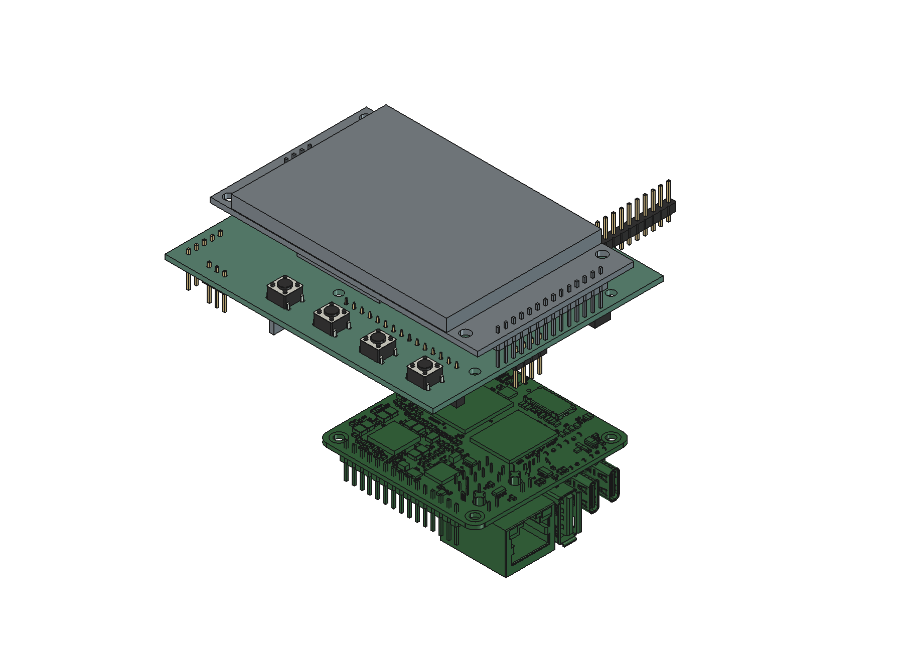

#  A7S Cyberdeck Backplane

A hand-solderable backplane **shield for the [Radxa Cubie A7S](https://radxa.com/products/cubie/a7s/)**
(Allwinner A733). It fans the A7S's 45 header pins out into a cyberdeck I/O board: dual swappable
radios, an input MCU, a touchscreen, and a Flipper-compatible expansion header.

> **Status:** schematic/netlist complete and verified; PCB placed and fully routed, but the floorplan
> is a **working starting point**, not a finalized layout. See [Before you fabricate](#before-you-fabricate)
> before ordering boards.

---

## Preview

Exploded 3D assembly (rough render, real STEP models). Top → bottom:

- **2.8" TFT screen** (front, user-facing)
- **the backplane** — buttons + Flipper socket on the **front**; connector headers + RP2040 + radios on the **back**
- **the Radxa Cubie A7S** it mounts onto



---

## Features

| Block | Detail |
|---|---|
| **2× "8+1" radio sockets** | Shared SPI1. Drop-in for **nRF24L01+ / CC1101 / CC2500** (8-pin nRF24 pin order + an AUX pin 9 for ESP-01 / breadboard use). Both radios can run simultaneously. |
| **RP2040-Zero input MCU** | Human inputs **only** — 4 on-board buttons + 2 off-board, joystick, rotary encoder. It is *not* a radio bridge; every radio line maps straight to an A7S header pin. |
| **2.8" SPI TFT** | ILI9341 display with resistive (XPT2046) touch. |
| **Flipper GPIO header** | Real two-connector layout (1×8 + 1×10, 17.78 mm gap) as a **female socket**, on the front, so genuine Flipper-ecosystem add-ons mate. |
| **Power** | Taps **5 V and 3V3 from the A7S header** (an external battery powers the A7S over its own USB-C port). Radio rails are polyfused. |

## Design choices

- **All through-hole / hand-solder.** No SMD, no pick-and-place — it's a backplane you solder to.
- **2-layer**, designed to be routed on two sides.
- Schematic/netlist generated with **[SKiDL](https://github.com/devbisme/skidl)**; board built with the
  KiCad **pcbnew** Python API; autorouted headless with **[freerouting](https://github.com/freerouting/freerouting)**.
- A7S header geometry sits on **STEP-measured datums** (`refs/MECH-DATUMS.md`) so the shield mates correctly.

## Repository layout

```
BACKPLANE-DESIGN.md      full design doc
BOM-SHIELD.md            shield parts list (sourcing links, no prices)
BOM-DECK.md              full-deck system parts list (sourcing links, no prices)
SCHEMATIC.md             authoritative netlist / connectivity (source of truth)
a7s_backplane_skidl.py   netlist generator  ->  a7s_backplane.net
kicad/                   pcbnew board, build_pcb.py, renders
a7s.pretty/              custom footprints (TFT, RP2040-Zero, Flipper — see ATTRIBUTION.md)
refs/                    measured mechanical datums
tools/                   kpython wrapper (runs pcbnew against the nix KiCad libs)
```

## Build / regenerate

```sh
# 1. netlist (after editing the schematic)
skidl-python a7s_backplane_skidl.py            # -> a7s_backplane.net

# 2. board from the netlist
tools/kpython kicad/build_pcb.py               # -> kicad/a7s_backplane.kicad_pcb

# 3. route (headless): export DSN -> freerouting -> import SES
tools/kpython -c "import pcbnew;b=pcbnew.LoadBoard('kicad/a7s_backplane.kicad_pcb');pcbnew.ExportSpecctraDSN(b,'kicad/a7s_backplane.dsn')"
freerouting -de kicad/a7s_backplane.dsn -do kicad/a7s_backplane.ses -mp 100 -mt 4
tools/kpython -c "import pcbnew;b=pcbnew.LoadBoard('kicad/a7s_backplane.kicad_pcb');pcbnew.ImportSpecctraSES(b,'kicad/a7s_backplane.ses');pcbnew.SaveBoard('kicad/a7s_backplane.kicad_pcb',b)"
```

## Additional Notes

I think the radio headers belong in the left top corner so that any radio chips you plug in will be standing up vertically behind the deck & 90 degrees from the flipper headers becuase radio likes angles.

Yes its a lot of IO, I wanted to max out what was available in the friendliest way possible supporting cheap available modules that already exist in the market.


## Before you fabricate

**Board sides:** connector headers (J1/J2 A7S, J5/J6 radios, J8 joystick, J10 encoder, J11 buttons) and
the RP2040 are on the **back**; the screen, Flipper socket, and the 4 push-buttons are on the **front**.

This board has **not** been fab-verified. Check these first:

1. **Floorplan is a WIP.** Sides are set, but placement/routing are a routed starting point — do a manual
   placement/route refinement pass in the KiCad GUI before ordering.
2. **RP2040-Zero footprint row spacing** is assumed **15.24 mm** — confirm against your actual module.
3. **Header pin-1 orientation** vs the A7S must be verified so the shield mates the right way round
   (datum *centers* are exact; pin-1 end/row is not yet confirmed — see `refs/MECH-DATUMS.md`).
4. **Radio headers — 2× "8+1", on the back.** Two *separate* 8-pin (2×4) sockets, each with its
   **AUX (+1) pin directly underneath**. Place them **next to each other** on the **backside** of the
   board. Cheap radio modules (nRF24 / CC1101 / CC2500) plug in there and **stand up perpendicular to the
   backplane** (antennas up), oriented **90° to the Flipper headers**. Keep them clear of the A7S board
   outline and the SPI header.
5. **Flipper headers — 2 connectors, on the front.** The Flipper GPIO is *two* headers — **1×8 + 1×10
   with a fixed 17.78 mm gap** between them, populated as a **female socket** — standing up at **90° to the
   deck** (i.e. 90° from the radio modules). Keep that spacing exact so genuine Flipper accessories mate.
6. **DRC:** the display-body courtyard floats over the back-side parts, so `pth_inside_courtyard` items
   are expected/cosmetic — distinguish those from real clearance errors.

## Credits

Flipper GPIO footprints from **[kbembedded/flipper-gpio-eda](https://github.com/kbembedded/flipper-gpio-eda)**
(BSD-2-Clause) — see [`a7s.pretty/ATTRIBUTION.md`](./a7s.pretty/ATTRIBUTION.md). All other footprints are
original to this project.
