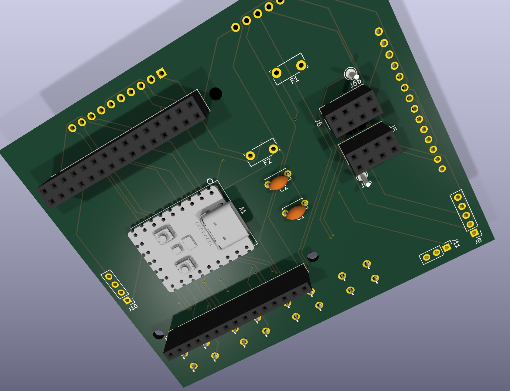

# A7S Backplane — **rev1** (frozen / superseded)

> **Do not fabricate rev1.** It has a port-orientation mistake (below). It is **superseded by
> [rev2](REV2.md)** and kept only for reference and diff. rev1 and rev2 share an **identical netlist** —
> only the physical layout differs.

**Status:** placed, fully routed (0 unconnected), fab package generated — then **frozen**. The electrical
design is correct and carried forward unchanged into rev2.

Files (all `a7s_backplane_render.*` / `render_*`):

- Board: [`kicad/a7s_backplane_render.kicad_pcb`](kicad/a7s_backplane_render.kicad_pcb) (the gerber source)
- Gerbers / drill: [`kicad/gerbers/`](kicad/gerbers/)
- Renders: [`kicad/render_full.png`](kicad/render_full.png), [`kicad/render_underside.png`](kicad/render_underside.png)
- Populated 3D: `../3dfiles/backplane_populated.step` / `.stl`

---

## The mistake

rev1 mounts the A7S so its **USB-C / USB-A / RJ45 ports face *inward*** — pointing at the radio sockets in
the middle of the deck — instead of outward off a board edge. As laid out, the ports are blocked and
unusable. This is a **placement error only**; the connectivity is correct.

**Fix → [rev2](REV2.md):** rotate the A7S 180° so the ports face outward, shift the mount 3 mm to keep the
ports proud of the board edge, and nudge the encoder to clear a mounting hole. All layout, no netlist change.

---

## Preview (rev1 renders)

**Top (deck face)** — 2.8" TFT, 4 buttons, Flipper socket:

**Underside** — RP2040, the two radio sockets, the A7S sockets (J1/J2), radio caps/fuses, and the
joystick/encoder/button solder pads:

---

## Electrical design

Identical to rev2 — see the shared docs:

- [SCHEMATIC.md](SCHEMATIC.md) — authoritative netlist / connectivity
- [SCHEMATIC-DIAGRAM.md](SCHEMATIC-DIAGRAM.md) — generated connectivity + bus diagrams
- [BACKPLANE-DESIGN.md](BACKPLANE-DESIGN.md) — full design doc + pin maps
- [BOM-SHIELD.md](BOM-SHIELD.md) / [BOM-DECK.md](BOM-DECK.md) — parts

Verified equivalence: rev1 and rev2 have the **same 26-component set** and the **same 160-pad → net map**
(byte-for-byte). rev1 routed to **0 unconnected** with 458 track segments + 16 vias; its DRC profile is the
same 101 cosmetic courtyard violations as rev2 (no electrical errors).
