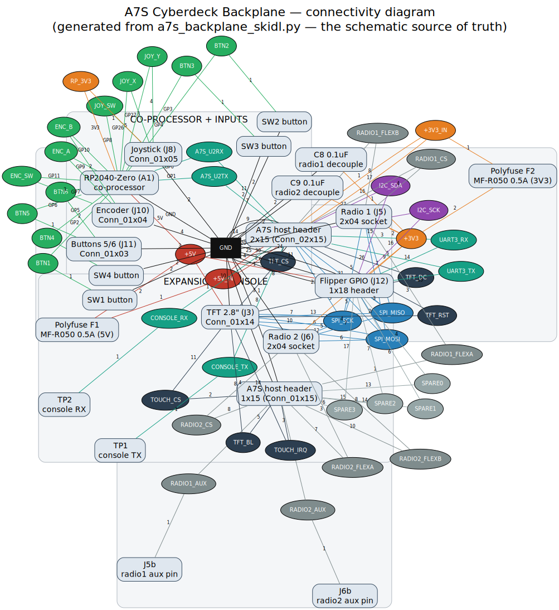

# A7S Backplane — Schematic Diagram

Readable, shareable views of the backplane connectivity. These are **documentation
artifacts generated from the schematic source of truth**
([`a7s_backplane_skidl.py`](a7s_backplane_skidl.py) → [`a7s_backplane.net`](a7s_backplane.net)) —
they are *not* editable KiCad schematics. See [SCHEMATIC.md](SCHEMATIC.md) for the
prose description.

## Full connectivity graph

Every part and every net, coloured by function (power, SPI, I2C, UART, TFT, radio,
inputs, spares). Edge labels are pin numbers/names.



- **SVG** (zoomable): [`a7s_backplane_schematic.svg`](a7s_backplane_schematic.svg)
- **PDF** (print/share): [`a7s_backplane_schematic.pdf`](a7s_backplane_schematic.pdf)
- **PNG**: [`a7s_backplane_schematic.png`](a7s_backplane_schematic.png)

## Bus-level block diagram

Higher-level view: which modules hang off which shared bus. The backplane is a
near-passive fan-out of the A7S host header onto shared SPI/I2C/UART buses plus
the RP2040 co-processor for inputs.

```mermaid
flowchart LR
  A7S["A7S host header<br/>J1 (2x15) + J2 (1x15)"]

  subgraph PWR["Power (native A7S rails)"]
    F1["F1 polyfuse<br/>+5V 0.5A"]
    F2["F2 polyfuse<br/>+3V3 0.5A"]
  end

  A7S -- "+5V_IN" --> F1
  A7S -- "+3V3_IN" --> F2

  subgraph SPI["SPI1 bus (SCK/MOSI/MISO)"]
    TFT["TFT 2.8\" + touch<br/>J3"]
    R1["Radio 1<br/>J5"]
    R2["Radio 2<br/>J6"]
  end

  A7S -- "SPI + TFT_CS/DC/RST/BL" --> TFT
  A7S -- "SPI + CS/FLEX/AUX" --> R1
  A7S -- "SPI + CS/FLEX/AUX" --> R2
  F1  -- "+5V" --> TFT
  F2  -- "+3V3" --> R1 & R2

  subgraph MCU["RP2040-Zero co-processor (A1)"]
    BTN["Buttons SW1-6<br/>+ J11"]
    JOY["Joystick J8"]
    ENC["Encoder J10"]
  end

  A7S -- "UART2 (GP0/GP1 cross-over)" --> MCU
  F1  -- "+5V" --> MCU
  BTN & JOY & ENC --> MCU

  FLIP["Flipper GPIO header<br/>J12 (1x18)"]
  A7S -- "SPI + UART3 + I2C + spares + power" --> FLIP

  CON["Console test points<br/>TP1 / TP2"]
  A7S -- "CONSOLE_TX/RX" --> CON
```

## Regenerating

Connectivity lives in [`a7s_backplane_skidl.py`](a7s_backplane_skidl.py). The diagram
mirrors it via [`tools/gen_schematic_diagram.py`](tools/gen_schematic_diagram.py)
(keep the two in sync — the tool's dicts are copied from the SKiDL source):

```sh
# structured (clustered) layout + force-directed (flat) layout
python3 tools/gen_schematic_diagram.py              # -> tools/a7s_backplane.dot
python3 tools/gen_schematic_diagram.py --no-clusters # -> tools/a7s_backplane_flat.dot

nix-shell -p graphviz --run "
  neato -Tsvg -Goverlap=false -Gsplines=true -Gsep=+8 \
    tools/a7s_backplane_flat.dot -o a7s_backplane_schematic.svg
  neato -Tpdf -Goverlap=false -Gsplines=true -Gsep=+8 \
    tools/a7s_backplane_flat.dot -o a7s_backplane_schematic.pdf
  neato -Tpng -Gdpi=120 -Goverlap=false -Gsplines=true -Gsep=+8 \
    tools/a7s_backplane_flat.dot -o a7s_backplane_schematic.png
"
```
